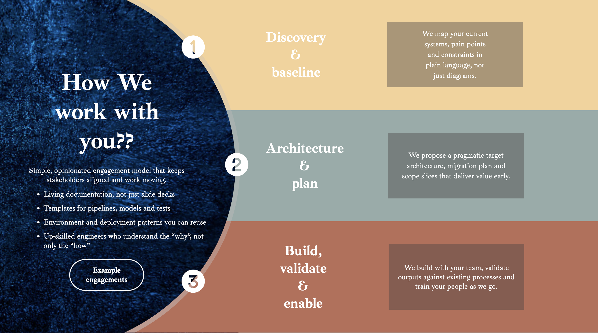
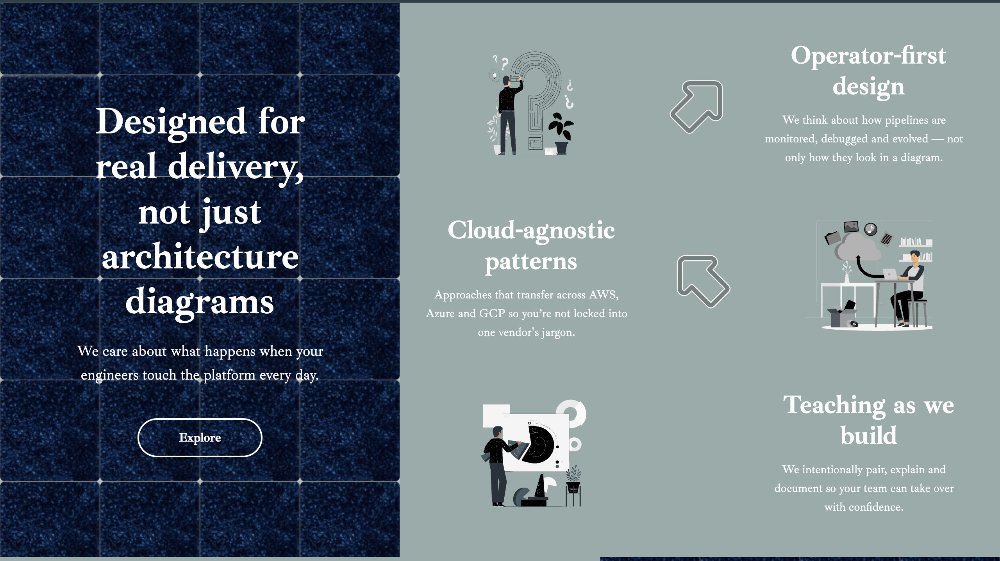
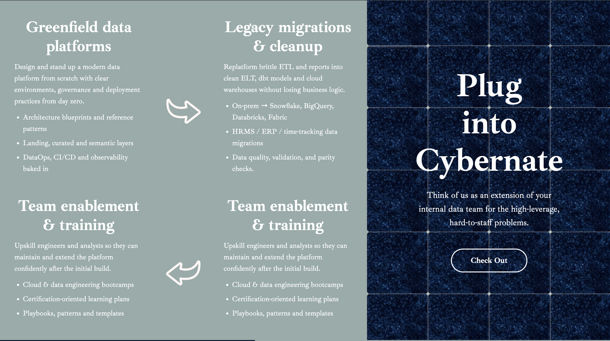
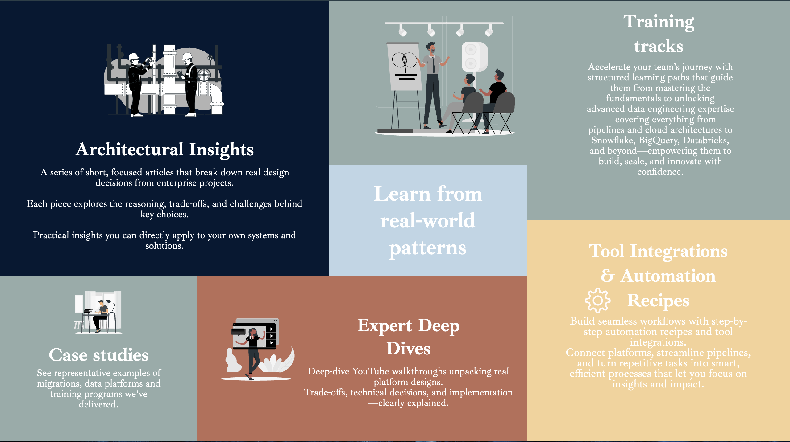
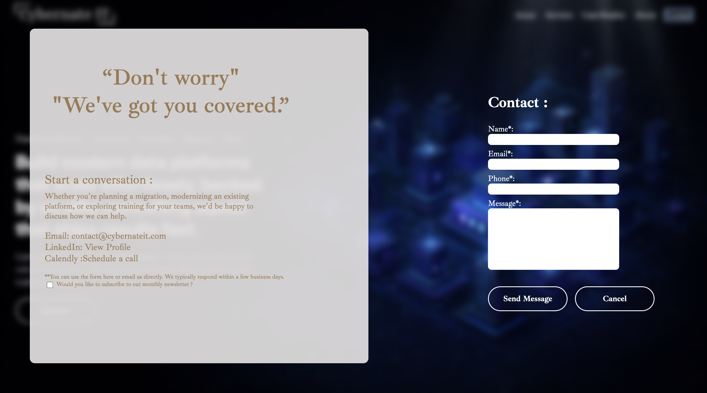
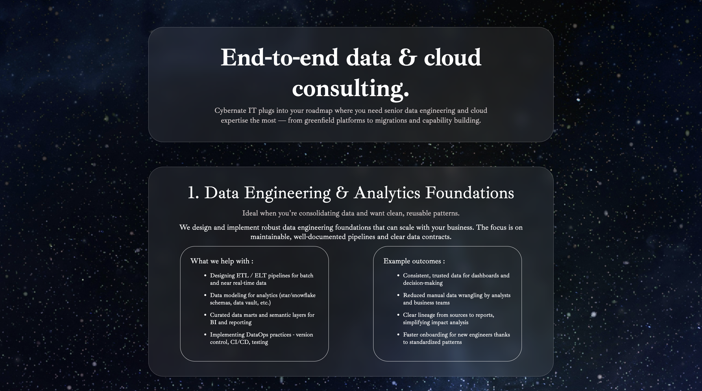

# 🚀 Cybernate-IT Website Redesign

A modern, responsive, and visually engaging redesign of the official **Cybernate-IT** website built using **React.js** and modern UI/UX practices.

🔗 Original Website: https://cybernate-it.com/

---

## 📌 Project Overview

This project is a complete frontend redesign of the Cybernate-IT website with a strong focus on:

- Clean and modern UI
- Smooth animations and transitions
- Component-based architecture
- Improved user experience

The objective was to transform the existing website into a more **interactive, scalable, and visually appealing platform** suitable for modern users and businesses.

---

## ✨ Key Features

- ⚛️ Built using **React.js (Vite)**
- 🎨 Modular and reusable **UI components**
- 💫 Smooth **scroll-based animations**
- 📱 Fully **responsive design**
- 🎯 Clean layout and improved visual hierarchy
- ⚡ Fast performance with optimized structure
- 🎭 Interactive UI elements (hover effects, transitions)

---

## 🛠️ Tech Stack

- **Frontend:** React.js, JavaScript (ES6+)
- **Build Tool:** Vite
- **Styling:** CSS Modules

---

## ⚜️ First Impressions

